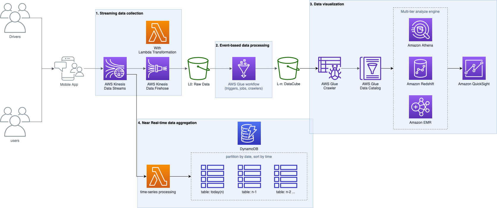

# aws-analytic

## Demo

### ETL - csv to parquet with data-type fine tune

- glue job configuration: [nyc-tlc-yellow-job.yaml](glue/nyc-tlc-yellow-job.yaml)
- python: [nyc-tlc-yellow.py](glue/nyc-tlc-yellow.py)
- description
    - Normalizing column names base on variable `column_mapping`
    - Declaring column types using variable `schema`
    - Mapping payment_type by user-defined-funtion `payment_type_f`
    - Transforming monthly csv data to parquet format by each year
        - Using `year` and `month` as partition keys

### Exploratory Data Analysis

- [validation-yellow-not-null.sql](athena/validation-yellow-not-null.sql)
    - Check data quality
- [validation-yellow-distinct.sql](athena/validation-yellow-distinct.sql)
    - Verify categorical data
- [validation-yellow-percentile.sql](athena/validation-yellow-percentile.sql)
    - Identify outlier value

### ETL - Filter outliers

- glue job configuration: [nyctlc-yellow-datacube-job.yaml](glue/nyctlc-yellow-datacube-job.yaml)
- python: [nyctlc-yellow-datacube.py](glue/nyctlc-yellow-datacube.py)
- description
    - Reading data which produced by `nyc-tlc-yellow.py`
    - Filtering data according to insight from `validation-yellow-percentile.sql`
    - Writing data to S3 for QuickSight as datasource
    - Visualizing metrics in QuickSight which use Athena as query engine to query data from S3

## Solution

1. Streaming data collection
    1. assign unique message_id
1. Event-based data processing
    1. Data cleansing
        1. Data distribution (Normal, Uniform, Bimodal)
        1. Outlier detection (Empirical Rule a.k.a. 68–95–99.7, Percentiles)
        1. Fill NULL (Pearson correlation coefficient, Imputation) or Drop
    1. Parquet optimization
        1. Partitioning vs Bucketing (Clustering)
        1. block/row group/file size
        1. Columns ordering
    1. Data catalog, Data layer, Data cube, Data mart
    1. ~~data governance~~
1. Data visualization
    1. Query optimization
        1. Reduce shuffling size
1. ~~Near Real-time data aggregation~~
    1. ~~time-series based data processing~~
